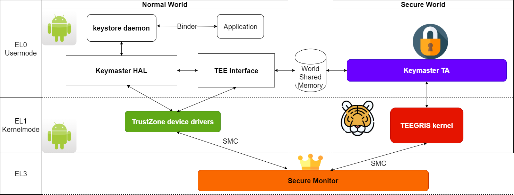

# Keybuster

Keybuster is a research tool that allows to interact with the Keymaster TA (Trusted Application) on Samsung devices that run Android.
Keybuster implements a Keymaster client - based on the `libkeymaster_helper.so` library from Samsung's Keymaster HAL - that sends custom requests to the Keymaster TA without any input validation or filtering.

## Research Paper

This repository provides supplemental code and information to our paper "Trust Dies in Darkness: Shedding Light on Samsung's TrustZone Keymaster Design".
If you found it useful, please cite our paper:

```
@inproceedings{shakevsky2022trust,
  title={Trust Dies in Darkness: Shedding Light on Samsung's TrustZone Keymaster Design},
  author={Shakevsky, Alon and Ronen, Eyal and Wool, Avishai},
  booktitle = {31st {USENIX} Security Symposium ({USENIX} Security 22)},
  address = {Boston, MA},
  year={2022},
  publisher = {{USENIX} Association},
  month=aug
}
```

The paper can be found at:

- [USENIX Security 22 paper](https://TBD)
- [Extended preprint paper (IACR ePrint)](https://TBD)

### Abstract

ARM-based Android smartphones rely on the TrustZone hardware support for a Trusted Execution Environment (TEE) to implement security-sensitive  functions. The TEE runs a separate, isolated, TrustZone Operating System (TZOS), in parallel to Android. 
The implementation of the cryptographic functions within the TZOS is left to the device vendors, who create proprietary undocumented designs. 

In this work, we expose the cryptographic design and implementation of Android's Hardware-Backed Keystore in Samsung's Galaxy S8, S9, S10, S20, and S21 flagship devices. 
We reversed-engineered and provide a detailed description of the cryptographic design and code structure, and we unveil severe design flaws. 
We present an IV reuse attack on AES-GCM
that allows an attacker to extract hardware-protected  key material, and a downgrade attack that makes even the latest Samsung devices vulnerable to the IV reuse attack. We demonstrate working key extraction attacks on the latest devices. We also  show the implications of our attacks on two higher-level cryptographic protocols between the TrustZone and a remote server: we demonstrate a  working FIDO2 WebAuthn login  bypass and a compromise of Google’s Secure Key Import. 

We discuss multiple flaws in the design flow of TrustZone based protocols. Although our specific attacks only apply to the ≈100 million devices made by Samsung, it raises the much more general requirement for open and proven standards for critical cryptographic and security designs.

## Disclaimer

This is a research project that allows to reproduce our results. We hope it will motivate further research on Keystore security and lead to a uniform open standard for the Keymaster HAL and TA. However, it is not meant to be comprehensive, fully functional or well tested.

We reported our attacks to Samsung Mobile Security and they released patches (in August 2021 and in October 2021) that fix the issues. We thank Samsung for reviewing our work, assigning the High severity CVEs, and coordinating the public disclosure.

## Why

### Brief Introduction

For the complete introduction and background please refer to the extended paper.

---

The [Android Keystore](https://source.android.com/security/keystore) provides hardware-backed cryptographic key management services through a Hardware Abstraction Layer (HAL) that vendors such as Samsung implement. 

The Keystore exposes an API to Android applications, including cryptographic key generation, secure key storage, and key usage (e.g., encryption or signing actions). Samsung implements the HAL through a Trusted Application (TA) called the Keymaster TA, which runs in the TrustZone-based TEE. The Keymaster TA performs the cryptographic operations in the Secure World using hardware peripherals, including a cryptographic engine. 

Although it is crucial to rigorously verify and test such cryptographic designs, real-world TrustZone implementations received relatively little attention in the literature. We believe that this is mainly due to the fact that most device vendors do not provide detailed documentation of their TZOS and proprietary TAs and share little-to-no information regarding how the sensitive data is protected. To advance and motivate this research area, we decided to use the leading Android vendor Samsung as a test case. We reversed-engineered the full cryptographic design and API of several generations of Samsung's Keymaster TA, and asked the following questions:

*Does the hardware-based protection of cryptographic keys remain secure even when the Normal World is compromised? How does the cryptographic design of this protection affect the security of various protocols that rely on its security?*

---

The following figure[^1] from the paper provides an overview of the Hardware-Backed Keystore: 


### How Keybuster is useful

Keybuster allows us to explore the Keymaster TA without any restrictions that the Keymaster HAL enforces. It enables: 

- To pass arbitrary parameters to the Keymaster TA, including the undocumented `KM_TAG_EKEY_BLOB_IV` and `KM_EKEY_BLOB_ENC_VER` tag which are crucial for the IV reuse and downgrade attacks (respectively).
- To bypass keyblob hash checks and send invalid or modified blobs to the Keymaster TA.
- To improve the performance of the Keymaster client or patch its implementation.

Overall, Keybuster exposes a lot of uncharted attack surface and was very useful for our research.

## Getting Started

### Requirements

Keybuster requires sufficient permissions (root and SELinux context) to access TZ drivers. To achieve this, we rooted our device using [Magisk](https://github.com/topjohnwu/Magisk) and used the strong context that it provides.

Note that rooting the device is not necessary - in the attack model that we use in the paper, we assume that an attacker has compromised the Normal World entirely (it should be enough to compromise a system service that can communicate with the kernel driver that switches to the Secure World, e.g., `keystored`) which is possible without rooting.

### Build from source

Building requires Android NDK. Run:

```bash
ndk-build -C jni
```

See [`build.sh`](build.sh) and adjust it per your NDK installation.

### Download from releases

The `keybuster` and `keybuster_test` binaries can be downloaded from the latest release.

### Running

Run the following command on your desktop computer to upload the binary to the device:
```bash
adb push ./libs/arm64-v8a/keybuster /data/local/tmp/keybuster
```

Run the following command on the Android device to execute the tool:

```bash
adb shell
su # enter a strong context, e.g. by rooting with Magisk
chmod +x /data/local/tmp/keybuster
/data/local/tmp/keybuster # pass --help to see the supported commands
```

### Testing

To perform some basic tests, repeat the instructions in the above section with `keybuster_test` instead of `keybuster`.

### Extending

As described in [Android.mk](jni/Android.mk), the default `keybuster` uses `libkeymaster_helper.so` as-is. It is possible to use a different implementation that is TZOS-specific (e.g., we implemented `keybuster_mod_TEEGRIS` and `keybuster_mod_KINIBI`). This allows to patch or replace the Keymaster HAL entirely and bypass any restrictions.

The default `keybuster` already allows to pass custom parameters and reach undocumented code paths in the Keymaster TA - however to modify a keyblob we needed to implement the functions that `libkeymaster_helper.so` exports (or patch them) to avoid the hash check. The extensions code will not be available here (and is not relevant to our results) but we can advice anyone that is interested to implement them.

### Project Structure

The project has the following structure:

- `core/` 
    - `attack.*` - IV reuse attack
    - `file_utils.*` - common file utilities
    - `main.c` - CLI
    - `skeymaster_api.*` - Wrappers of `skeymaster_commands.*` that can be called from the CLI
    - `skeymaster_asn1.*` - Handlers of vendor-specific ASN.1 structures
    - `skeymaster_commands.*` - Wrappers of Keymaster API (e.g., `generateKey`)
    - `skeymaster_crypto.*` - Handlers of OpenSSL functions
    - `skeymaster_defs.*` - Common Keymaster-related definitions
    - `skeymaster_helper.h` - Definition of Keymaster Helper API
    - `skeymaster_key_params.*` - Key parameter utilities
    - `skeymaster_libs.*` - Import required symbols from libraries (e.g., `libcrypto.so` and `libkeymaster_helper.so`)
    - `skeymaster_log.h` - Logging utilities
    - `skeymaster_status.h` - Status code
    - `skeymaster_utils.*` - General Utilities
- `keymaster_helper_lib/` - default extension for Keymaster Helper
    - `skeymaster_helper_lib.c` - Wrappers of `libkeymaster_helper.so` API that implements the API from `skeymaster_helper.h`
- `poc/` - proof of concepts for IV reuse and downgrade attacks


## Proof of Concept

Keybuster was used to implement proof-of-concept attacks against the Keymaster TA that achieve unauthorized access to hardware-protected keys and data secured by the TEE.

To reproduce [CVE-2021-25444](https://security.samsungmobile.com/securityUpdate.smsb?year=2021&month=8), please see [IV Reuse Attack PoC](poc/iv_reuse/README.md).

To reproduce [CVE-2021-25490](https://security.samsungmobile.com/securityUpdate.smsb?year=2021&month=10), please see [Downgrade Attack PoC](poc/downgrade/README.md).

## Writeup

For extended technical details, please see the [writeup](writeup.md).

[^1]: Designed using resources from Flaticon.com
